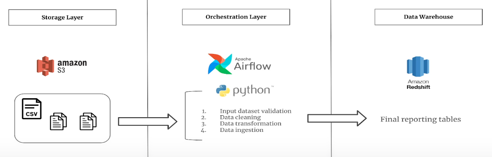

# Batch Data Processing of the Music Streams using Airflow and Redshift

## 1️⃣ Problem Description

A music straming platform collects the data from thousands of Users and store that into the S3 bucket on frequenct basis. We need to generate reports from this data and store them in such a way that we can unalbe analytics on the data.

> The goal of this project is to build a pipeline that reads data from the S3 buckets, so transformations on that and stores the data into the Redshift Serverless.
> It will also Involve -
> 1. Setting up MWAA environment to orchestrate our pipelines.
> 2. Setting up Redshift Serverless Namespace and Workgroup so that data can be stored in it.
> 3. Writing inbound and outbound rules to ensure security.
> 4. Writing trust policies for the resources that follow Principle of Least Priviledge.

---

## 2️⃣ Solution Architecture

---

## 3️⃣ Details About Solution Architecture

1. **Data Ingestion**  
   Data is ingested from the files placed in S3 on frequenct pre-defined intervals.
2. **Data Processing**  
   The raw data is processed using the Python transformations written in the Airflow DAG code.
3. **Data Storage**  
   Processed data is stored in Amazon Redshift for querying and analytics.
4. **Monitoring & Logging**  
   AWS CloudWatch is used for monitoring the pipeline and logging errors.

---

## 4️⃣ Services Used

Provide a list of services, along with **their purpose in your solution**.

| Service | Purpose |
|---------|---------|
| **Amazon S3** | Store processed data in a data lake format |
| **Amazon Redshift** | Query processed data efficiently for analytics |
| **Amazon MWAA** | Orchestrate workflows and manage dependencies between tasks (if used) |

