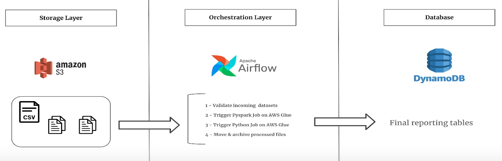

# ETL using Airflow, Spark and DynamoDB

## 1️⃣ Problem Description

Data arrives from the music streaming platform into our S3 bucket on **Random Intervls**. Goal is to perform transformations on this data and make it avaialble to the downstream application as soon as possible. This is not a batch ETL as we are not aware that how frequently the files will arrive to our S3.

> The goal of this project is to build a scalable data pipeline that ingests real-time streaming data, processes it, and stores it in a queryable format. The pipeline should handle high throughput and be cost-efficient.

---

## 2️⃣ Solution Architecture

---

## 3️⃣ Details About Solution Architecture

Provide a textual explanation of the architecture diagram. Explain the **data flow**, **processing steps**, and any **key design decisions**.

**Example:**
1. **Data Ingestion**  
   Data is ingested from multiple sources using AWS Kinesis Data Streams.
2. **Data Processing**  
   The raw data is processed using AWS Lambda functions for real-time transformations.
3. **Data Storage**  
   Processed data is stored in Amazon S3 in Parquet format for analytics and in Amazon Redshift for querying.
4. **Monitoring & Logging**  
   AWS CloudWatch is used for monitoring the pipeline and logging errors.

---

## 4️⃣ Services Used

| Service | Purpose |
|---------|---------|
| **AWS Glue** | Python shell for Python workloads |
| **AWS Glue** | Spark for big data processing |
| **Amazon S3** | Store processed data in a data lake format |
| **Amazon DynamoDb** | Managed NoSQL Database |
| **AWS CloudWatch** | Monitor and log pipeline activity |
| **Amazon MWAA** | Orchestrate workflows and manage dependencies between tasks|
